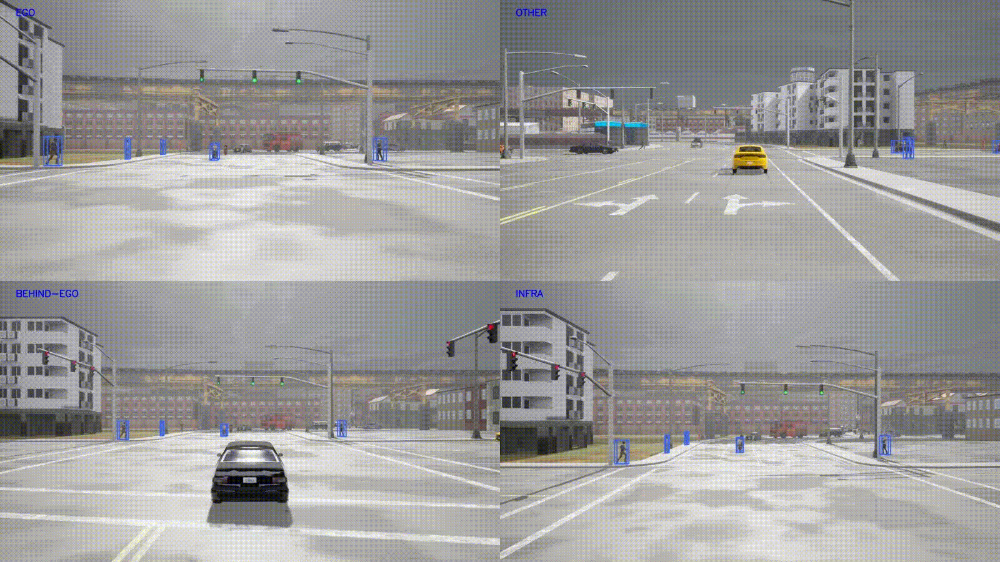

## CVIPS: Connected Vision for Increased Pedestrian Safety

### CVIPS

Our approach tackles the detection and trajectory prediction challenges of VRUs in both standard and edge-case scenarios. We propose implementing a cooperative perception system that involves sharing and fusing multi-view camera data from multiple agents to achieve precise and reliable results. 
